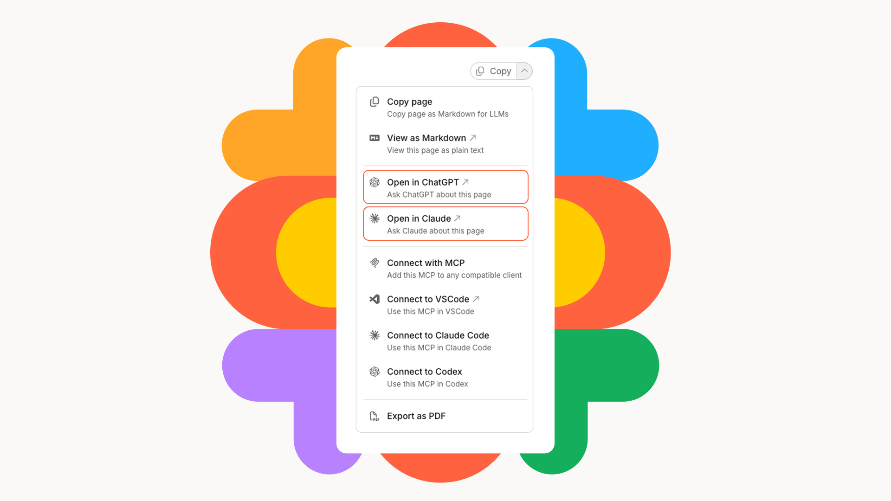
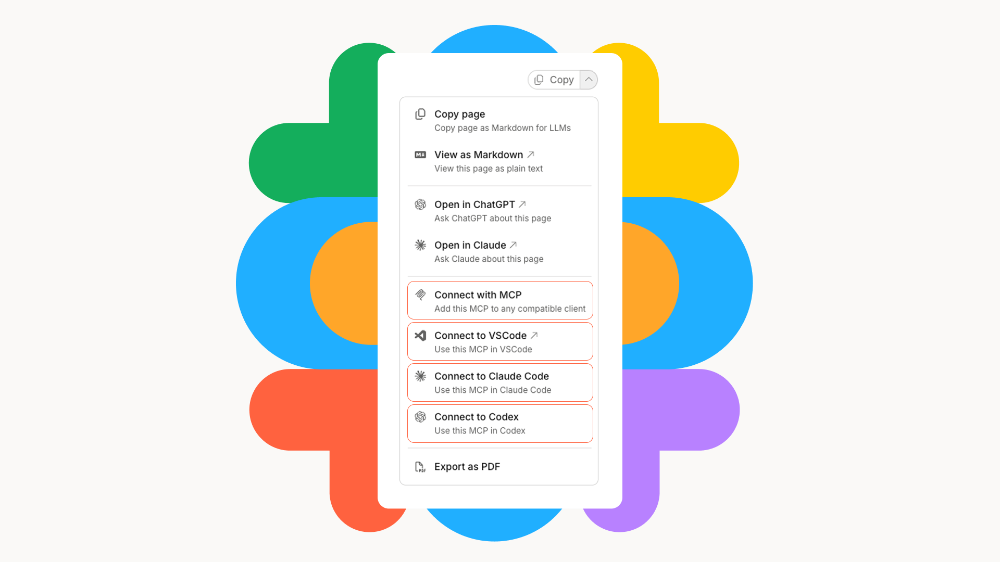
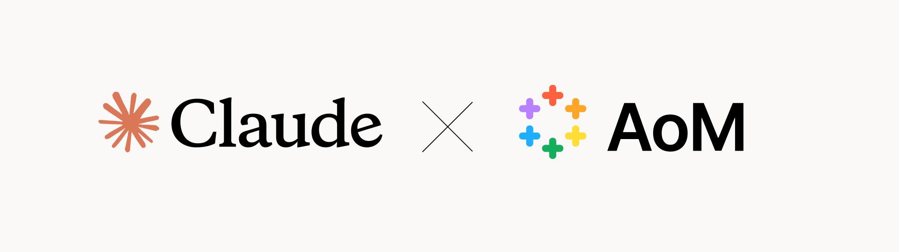

# Using AoM with AI

This wiki is designed so AI can read it clearly. Every page is structured consistently, every image and framework has a text description, and the whole site can be connected to your AI tools so they have ongoing access to the full framework, including updates as it evolves.



### Why connect the AoM to your AI

Once connected, your AI has ongoing access to the full AoM framework. It can search across every definition, every fundamental, and every connected tool, and stays current as the AoM updates each quarter.

Rather than asking your AI a generic question and getting a generic answer, you can give it the AoM as a shared structure and ask it to reason within that structure. The outputs are more precise, more consistent, and directly connected to how your business thinks about marketing.

#### Example prompts

**Understand a framework distinction**


```
Using the AoM, what is the difference between a Channel Strategy and a Channel Plan, and where does each sit in the model?
```


**Check licensing and usage terms**


```
What are the attribution requirements if I want to use the AoM in my client work or build it into a product?
```


**Learn the model structure**


```
Give me an overview of the AoM Fundamental View. What are the six sections and what does each one cover?
```


**Tell your AI about your business and get a diagnosis**


```
Here is a summary of our business and where we are with marketing: [paste your context]. Using the AoM, which fundamentals should we prioritise and where are the likely gaps in our current approach?
```


**Assess existing work against the AoM**


```
Here is our current brand strategy brief: [paste your brief]. Using the AoM, assess whether it covers the key Brand Strategy fundamentals and identify anything missing or underdeveloped.
```


You do not need to tell your AI to use the AoM in every message. Once connected it will draw on it when relevant. For best results start a new conversation after connecting and use one of the prompts above to get going.



#### Two ways to connect the AoM to your AI

### Temporary connection: Share a URL

The simplest starting point is to share the URL with your chosen AI model.



#### **Share the AoM URL directly**

Copy the below URL and paste it into your preferred AI tool.


```
https://wiki.anatomyofmarketing.org/llms.txt
```


<p align="center">OR</p>



#### **Open the copy dropdown menu on any AoM page**

<figure><figcaption></figcaption></figure>

From the Copy menu in the top right of any page, click Open in 'ChatGPT' OR 'Open in Claude'.



Both these methods give your AI access to the AoM at that moment. Your AI can browse further from there. This is useful for a one-off task or a quick question. It is not a persistent connection and does not automatically update as the AoM evolves.



### **Persistent connection: Connect via MCP (recommended)**

Build a persistent connection to give your AI ongoing, searchable access to the full AoM wiki. It stays current as the AoM updates each quarter. Choose the method that matches your preferred AI tool from the below.

<figure><figcaption></figcaption></figure>

<figure><figcaption></figcaption></figure>

### **Connect to Claude**

_Available on all Claude plans including Free. Free accounts are limited to one custom connector. On Team and Enterprise plans an Owner must add the connector at organisation level before members can connect. Once configured, connectors sync automatically across web, Desktop, and mobile. Check_ [_support.claude.com_](https://support.claude.com) _for the latest plan details as this feature is in beta._



#### Open Connectors

Click your profile icon → Settings → Connectors.

<figure><figcaption></figcaption></figure>

<figure><figcaption></figcaption></figure>



#### Add a custom connector

Click Add → Add custom connector.

<figure><figcaption></figcaption></figure>



#### Enter the AoM details

Name the connector 'AoM' and paste the following URL then click Add.


```
https://wiki.anatomyofmarketing.org/~gitbook/mcp
```


<figure><figcaption></figcaption></figure>



#### Set tool permissions

AoM connects automatically and shows two tools: 'Get page content' and 'Search documentation'. Set both to Always allow so Claude can use them without asking for approval each time.

<figure><figcaption></figcaption></figure>



#### You are connected

Now just open a new conversation and try one of the [sample prompts](using-aom-with-ai.md#here-are-five-ways-to-start) to get started. The more context you give Claude about your business and decisions, the more useful AoM becomes.





<figure><figcaption></figcaption></figure>

### Connect to Claude Code

_Requires Claude Code installed. Available across all projects using the user scope flag._

1. **Step 1: Open your terminal**
2. **Step 2: Run the following command**\
   `claude mcp add --transport http aom https://wiki.anatomyofmarketing.org/~gitbook/mcp`
3. **Step 3: Make it available across all projects (optional)**\
   Add `--scope user` to make the connection available in every Claude Code session, not just the current project:\
   `claude mcp add --transport http --scope user aom https://wiki.anatomyofmarketing.org/~gitbook/mcp`
4. **Step 4: Confirm the connection**\
   Run `/mcp` inside a Claude Code session to confirm AoM appears and is connected.
5. **Step 5: You are connected**\
   Start a session and try it with the AoM →

For the latest setup guidance see the [official Claude Code documentation](https://code.claude.com/docs/en/mcp).



<figure><figcaption></figcaption></figure>

### **Connect to VSCode**

_Requires VSCode with GitHub Copilot in Agent mode. The AoM MCP server is added as a remote HTTP server._

1. **Open the Command Palette**\
   Press `Cmd+Shift+P` on Mac or `Ctrl+Shift+P` on Windows → type MCP: Add Server → select it.
2. **Select HTTP server**\
   Choose HTTP (Streamable HTTP) as the server type.
3. **Enter the AoM URL**\
   Paste the following URL when prompted:\
   `https://wiki.anatomyofmarketing.org/~gitbook/mcp`
4. **Name the server**\
   Name it AoM when prompted → select Global to make it available across all your projects, or Workspace to limit it to the current project.
5. **Confirm the connection**\
   VSCode adds the server to your mcp.json file automatically. Open a Copilot Chat in Agent mode and the AoM tools will be available.
6. **You are connected**\
   Start a chat in Agent mode and try it with the AoM →

_Alternatively add it manually by creating or opening `.vscode/mcp.json` in your project and adding:_ json

```json
{
  "servers": {
    "aom": {
      "type": "http",
      "url": "https://wiki.anatomyofmarketing.org/~gitbook/mcp"
    }
  }
}
```

For the latest setup guidance see the [official VSCode MCP documentation](https://code.visualstudio.com/docs/agent-customization/mcp-servers).



<figure><figcaption></figcaption></figure>

### Connect to Codex

_Requires Codex CLI installed. Configuration is shared between the CLI and the Codex IDE extension._

**Step 1: Add the AoM server via CLI**\
Run the following command in your terminal:\
`codex mcp add aom --url https://wiki.anatomyofmarketing.org/~gitbook/mcp`\
&#xNAN;_&#x41;lternatively add it manually by opening or creating `~/.codex/config.toml` and adding:_ toml

```toml
[mcp_servers.aom]
url = "https://wiki.anatomyofmarketing.org/~gitbook/mcp"
```

**Step 2: Confirm the connection**\
Run `/mcp` inside a Codex session to confirm AoM appears and is active.

**Step 3: You are connected**\
Start a session and try it with the AoM →

For the latest setup guidance see the [official Codex MCP documentation](https://developers.openai.com/codex/mcp).



### Attribution and commercial use

The AoM is openly licensed under CC BY-SA 4.0. Using it within your business or in client work requires attribution. Building a product or service that directly uses the AoM and selling it commercially requires a closer read of the licence terms and may require a partner agreement.


[usage-and-licensing.md](../governance/usage-and-licensing.md)



