# Brand Personality (Archetypes) Map

<figure>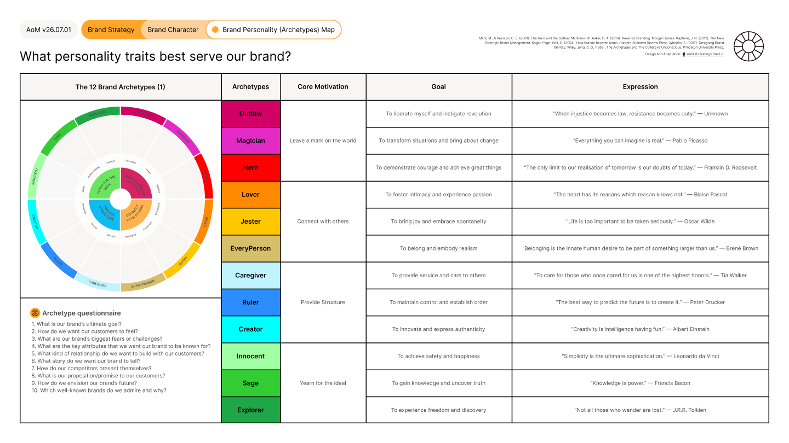<figcaption></figcaption></figure>



<figure>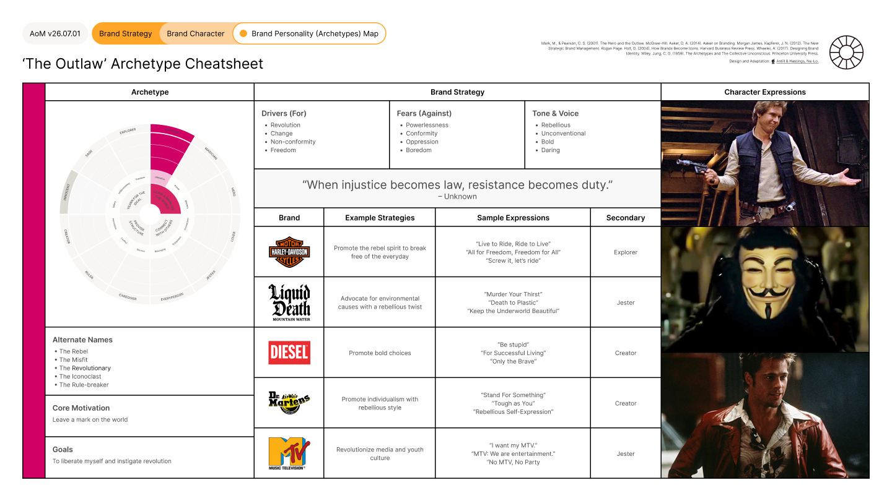<figcaption></figcaption></figure> <figure>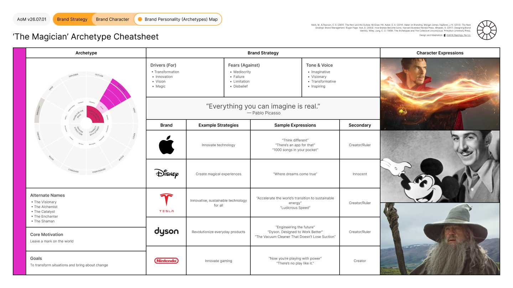<figcaption></figcaption></figure> <figure>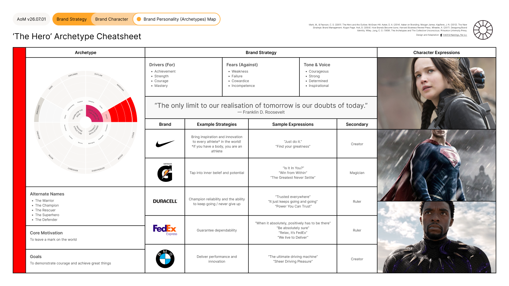<figcaption></figcaption></figure>

<figure>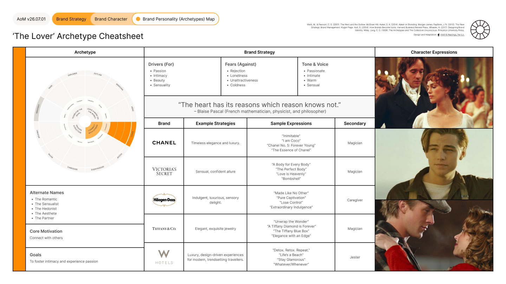<figcaption></figcaption></figure> <figure>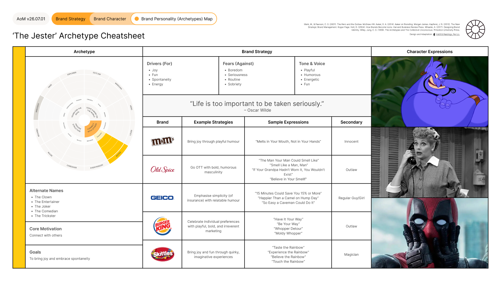<figcaption></figcaption></figure> <figure>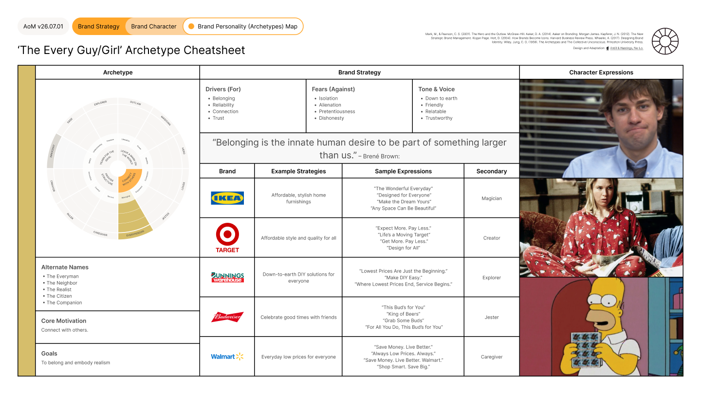<figcaption></figcaption></figure>

<figure>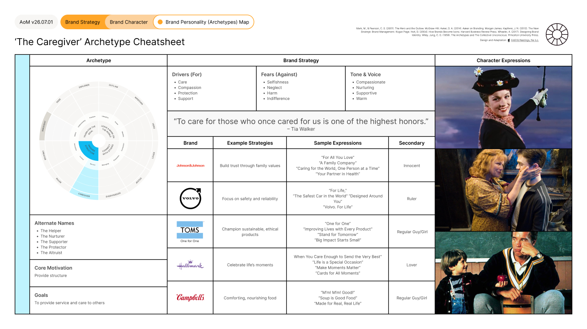<figcaption></figcaption></figure> <figure>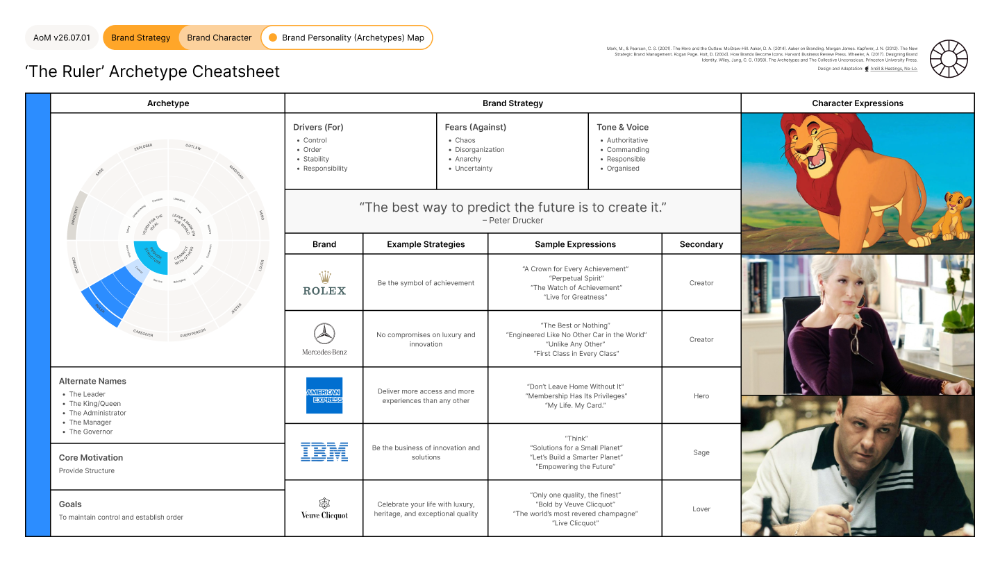<figcaption></figcaption></figure> <figure>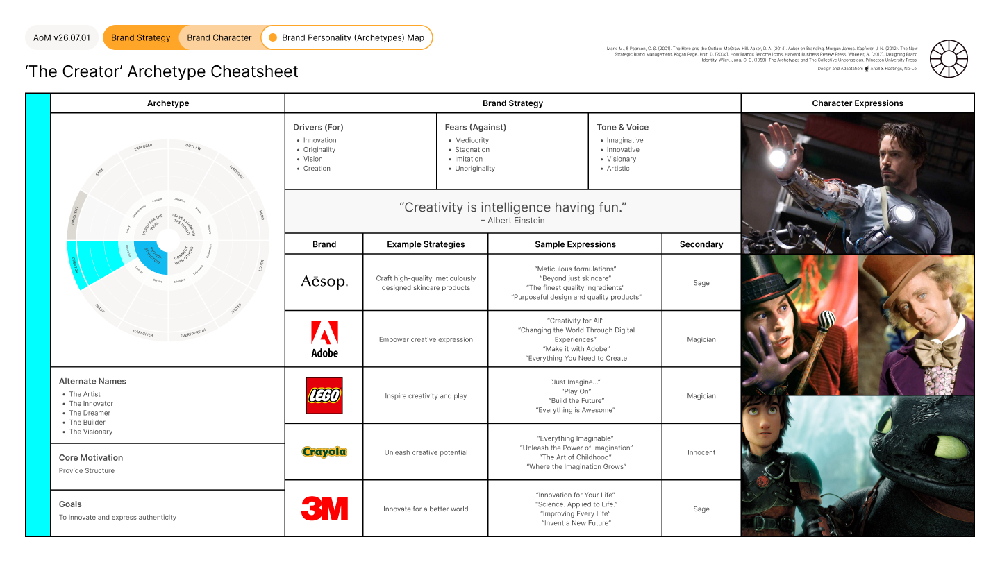<figcaption></figcaption></figure>

<figure>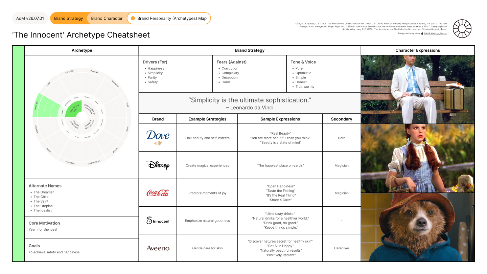<figcaption></figcaption></figure> <figure>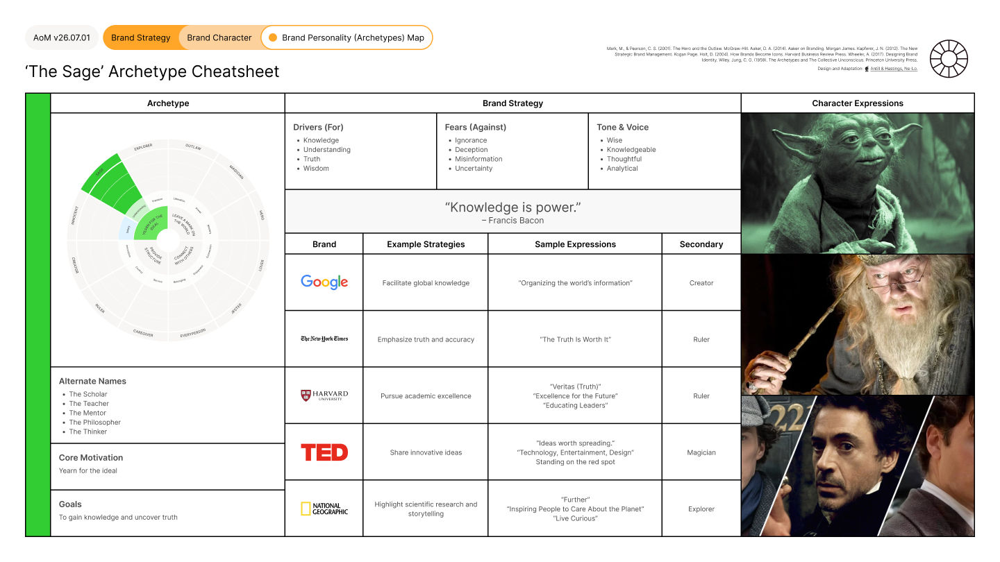<figcaption></figcaption></figure> <figure>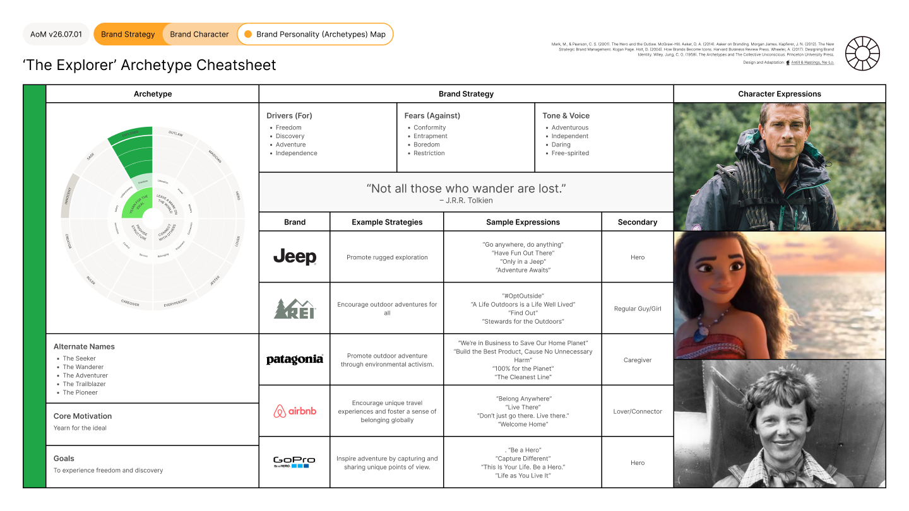<figcaption></figcaption></figure>



### Tool Notes

The Brand Personality (Archetypes) Map is one approach to defining brand personality. It draws on Carl Jung's twelve archetypal characters, adapted for brand strategy by Mark and Pearson in The Hero and the Outlaw (2001), to give teams a shared reference point for discussing and defining the personality traits that best serve a brand.

Archetypes are not the only way to define brand personality. Their specific value is in creating a common language: they help teams move past subjective adjectives and toward a recognisable, consistent human quality that an audience can relate to. They are also useful for competitive mapping, making it easier to identify personality positions that are overcrowded in a market and those that represent a genuine opportunity.

The framework includes a ten-question questionnaire designed to guide the conversation before a position is selected. This prevents teams from choosing an archetype based on aspiration or aesthetics rather than strategic fit.


#### Framework Content

The twelve archetypes, their core motivations, goals, and expressions:

**Outlaw.** Core motivation: leave a mark on the world. Goal: to liberate and instigate revolution. Expression: "When injustice becomes law, resistance becomes duty."

**Magician.** Core motivation: leave a mark on the world. Goal: to transform situations and bring about change. Expression: "Everything you can imagine is real." Pablo Picasso.

**Hero.** Core motivation: leave a mark on the world. Goal: to demonstrate courage and achieve great things. Expression: "The only limit to our realisation of tomorrow is our doubts of today." Franklin D. Roosevelt.

**Lover.** Core motivation: connect with others. Goal: to foster intimacy and experience passion. Expression: "The heart has its reasons which reason knows not." Blaise Pascal.

**Jester.** Core motivation: connect with others. Goal: to bring joy and embrace spontaneity. Expression: "Life is too important to be taken seriously." Oscar Wilde.

**EveryPerson.** Core motivation: connect with others. Goal: to belong and embody realism. Expression: "Belonging is the innate human desire to be part of something larger than us." Brené Brown.

**Caregiver.** Core motivation: provide structure. Goal: to provide service and care to others. Expression: "To care for those who once cared for us is one of the highest honours." Tia Walker.

**Ruler.** Core motivation: provide structure. Goal: to maintain control and establish order. Expression: "The best way to predict the future is to create it." Peter Drucker.

**Creator.** Core motivation: provide structure. Goal: to innovate and express authenticity. Expression: "Creativity is intelligence having fun." Albert Einstein.

**Innocent.** Core motivation: yearn for the ideal. Goal: to achieve safety and happiness. Expression: "Simplicity is the ultimate sophistication." Leonardo da Vinci.

**Sage.** Core motivation: yearn for the ideal. Goal: to gain knowledge and uncover truth. Expression: "Knowledge is power." Francis Bacon.

**Explorer.** Core motivation: yearn for the ideal. Goal: to experience freedom and discovery. Expression: "Not all those who wander are lost." J.R.R. Tolkien.

**Archetype questionnaire:**

1. What is our brand's ultimate goal?
2. How do we want our customers to feel?
3. What are our brand's biggest fears or challenges?
4. What are the key attributes we want our brand to be known for?
5. What kind of relationship do we want to build with our customers?
6. What story do we want our brand to tell?
7. How do our competitors present themselves?
8. What is our proposition and promise to our customers?
9. How do we envision our brand's future?
10. Which well-known brands do we admire and why?


### References

The framework draws on Margaret Mark and Carol S. Pearson's The Hero and the Outlaw (2001), David Aaker's Aaker on Branding (2014), Jean-Noël Kapferer's The New Strategic Brand Management (2012), Douglas Holt's How Brands Become Icons (2004), Alina Wheeler's Designing Brand Identity (2017), and Carl Jung's foundational work on archetypes from The Archetypes and The Collective Unconscious (1959). The Brand Personality (Archetypes) Map was designed and adapted for the AoM by Kieran Antill and Ross Hastings (2022), standardising the twelve archetypes into a structured selection framework and questionnaire within the AoM design system.

[_See all AoM References_](../../../governance/references.md)



### AoM Structure


{% column width="25%" %}
_Section_


{% column width="75%" %}

[brand-strategy](../../layer-two-fundamentals/brand-strategy/)





{% column width="25%" %}
_Sub-section_


{% column width="75%" %}

[positioning](../../layer-two-fundamentals/brand-strategy/positioning/)





{% column width="25%" %}
_Connected Fundamental(s)_


{% column width="75%" %}

[brand-personality.md](../../layer-two-fundamentals/brand-strategy/positioning/brand-personality.md)





