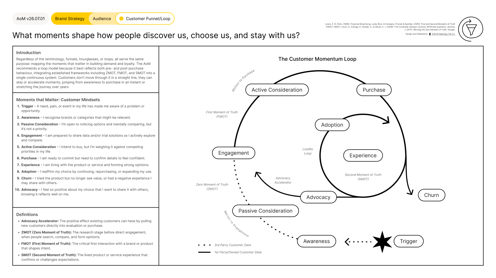

# Customer Funnel/Loop

<figure><figcaption></figcaption></figure>





### Tool Notes

The Customer Momentum Loop maps the ten mindset stages a customer moves through from initial trigger to advocacy, covering both pre-purchase and post-purchase behaviour in a single continuous model.

The AoM recommends a loop over a funnel or hourglass because a loop reflects how customers actually behave. They do not move through a linear sequence: they skip stages, accelerate, and re-enter at different points. The loop integrates established frameworks including ZMOT, FMOT, and SMOT into one connected system.

Sales, marketing, and after-sales teams should share the same model rather than developing separate versions. Separate models create misalignment on what constitutes a qualified lead, what conversion looks like, and where the handover between functions happens. A shared loop gives every team a common language for the customer journey.


#### Framework Content

The Customer Momentum Loop identifies ten customer mindset stages:

**Trigger.** A need, pain, or event has made the customer aware of a problem or opportunity.

**Awareness.** The customer recognises brands or categories that might be relevant.

**Passive Consideration.** The customer is open to noticing options and mentally comparing, but it is not yet a priority.

**Engagement.** The customer is prepared to share data and trial solutions as they actively explore and compare. This marks the Zero Moment of Truth (ZMOT): the research stage before direct brand engagement.

**Active Consideration.** The customer intends to buy but is weighing it against competing priorities. This marks the First Moment of Truth (FMOT): the critical first interaction that shapes intent.

**Purchase.** The customer is ready to commit but needs to confirm details to feel confident.

**Experience.** The customer is living with the product or service and forming strong opinions. This marks the Second Moment of Truth (SMOT): the lived experience that confirms or challenges expectations.

**Adoption.** The customer reaffirms their choice by continuing, repurchasing, or expanding their use. The Loyalty Loop begins here.

**Churn.** The customer no longer sees value, or had a negative experience they may share with others.

**Advocacy.** The customer feels positive enough to share their experience with others. Existing advocates can pull new customers directly into engagement or purchase via the Advocacy Accelerator.

The loop distinguishes between third-party customer data (dotted lines) and first-party owned customer data (solid lines), reflecting different data relationships at each stage.


### References

The framework draws on E. St. Elmo Lewis's foundational AIDA model from Financial Advertising (1898), Procter & Gamble's First and Second Moments of Truth framework (2005), David Court, Dave Elzinga, Susan Mulder, and Ole Jørgen Vetvik's Consumer Decision Journey from McKinsey Quarterly (2009), and Jim Lecinski's Zero Moment of Truth from Winning the Zero Moment of Truth, Google (2011). The Customer Momentum Loop was designed and adapted for the AoM by Kieran Antill and Ross Hastings (2022), integrating these frameworks into a single continuous loop model and standardising the language, colour coding, and structure within the AoM design system.

[_See all AoM References_](../../../governance/references.md)



### AoM Structure


{% column width="25%" %}
_Section_


{% column width="75%" %}

[brand-strategy](../../layer-two-fundamentals/brand-strategy/)





{% column width="25%" %}
_Sub-section_


{% column width="75%" %}

[audience](../../layer-two-fundamentals/brand-strategy/audience/)





{% column width="25%" %}
_Connected Fundamental(s)_


{% column width="75%" %}

[customer-funnel-loop.md](../../layer-two-fundamentals/brand-strategy/audience/customer-funnel-loop.md)





