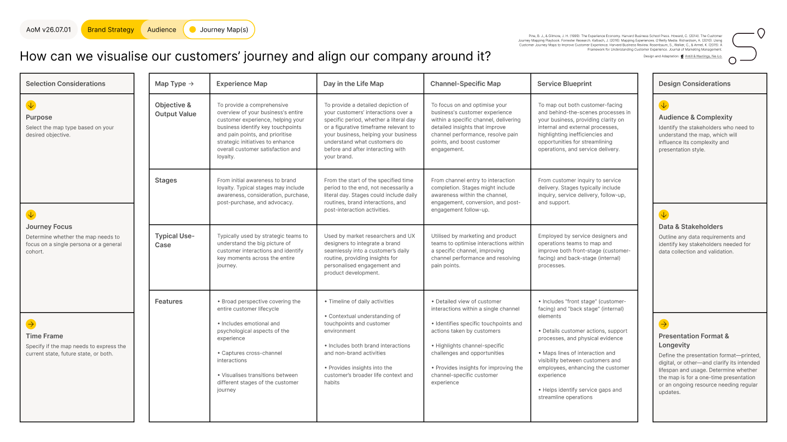

# Journey Maps

<figure><figcaption></figcaption></figure>





### Tool Notes

The Journey Maps guide helps teams select the right type of customer journey map for their objective and design it effectively. It is not a pre-built map: it is a structured decision framework for choosing between four map types and defining the key parameters before work begins.

The four map types serve different purposes. An Experience Map covers the full customer lifecycle from awareness to advocacy. A Day in the Life Map focuses on a specific period, understanding what customers do before and after interacting with the brand. A Channel Specific Map optimises the experience within a single channel. A Service Blueprint maps both customer-facing and internal behind-the-scenes processes together.

Choosing the wrong map type wastes the effort of building it. A strategic team needing to understand the full customer lifecycle does not need a Channel Specific Map. A UX team optimising a digital onboarding flow does not need a full Experience Map. The guide surfaces the selection decision before the design work begins.


#### Framework Content

The Journey Maps guide is structured across three sections: Selection Considerations, Map Type comparison, and Design Considerations.

**Selection Considerations.** Purpose: select the map type based on the desired objective. Journey Focus: determine whether the map needs to focus on a single persona or a general cohort. Time Frame: specify whether the map expresses current state, future state, or both.

**Map Type comparison across four types:**

Experience Map: objective is a comprehensive overview of the entire customer experience. Stages run from initial awareness to brand loyalty. Used by strategic teams to identify key moments across the full journey. Features include broad perspective covering the full lifecycle, emotional and psychological aspects, cross-channel interactions, and visualised transitions between stages.

Day in the Life Map: objective is a detailed depiction of customer interactions over a specific period. Used by market researchers and UX designers to integrate the brand into daily routines. Features include a timeline of daily activities, contextual understanding of touchpoints, and both brand and non-brand activities.

Channel Specific Map: objective is to optimise the experience within a single channel. Used by marketing and product teams to improve channel performance. Features include a detailed view of channel interactions, channel-specific touchpoints, and insights for improving channel experience.

Service Blueprint: objective is to map both customer-facing and behind-the-scenes processes. Used by service designers and operations teams. Features include front-stage and back-stage elements, customer actions, support processes, physical evidence, and lines of interaction and visibility between customers and employees.

**Design Considerations.** Audience and Complexity: identify the stakeholders who need to understand the map, which will influence its complexity and presentation style. Data and Stakeholders: outline data requirements and identify key stakeholders needed for data collection and validation. Presentation Format and Longevity: define whether the map is for a one-time presentation or an ongoing resource requiring regular updates.


### References

The framework draws on B. Joseph Pine and James H. Gilmore's The Experience Economy (1999), Colin Howard's The Customer Journey Mapping Playbook from Forrester Research (2014), Jim Kalbach's Mapping Experiences (2016), Adam Richardson's Using Customer Journey Maps to Improve Customer Experience from Harvard Business Review (2010), and Scott Rosenbaum, Colin Walker, and K. Armel's A Framework for Understanding Customer Experience from Journal of Marketing Management (2015). The Journey Maps guide was designed and adapted for the AoM by Kieran Antill and Ross Hastings (2022), synthesising these sources into a structured selection and design framework within the AoM design system.

[_See all AoM References_](../../../governance/references.md)



### AoM Structure


{% column width="25%" %}
_Section_


{% column width="75%" %}

[brand-strategy](../../layer-two-fundamentals/brand-strategy/)





{% column width="25%" %}
_Sub-section_


{% column width="75%" %}

[audience](../../layer-two-fundamentals/brand-strategy/audience/)





{% column width="25%" %}
_Connected Fundamental(s)_


{% column width="75%" %}

[journey-map-s.md](../../layer-two-fundamentals/brand-strategy/audience/journey-map-s.md)





