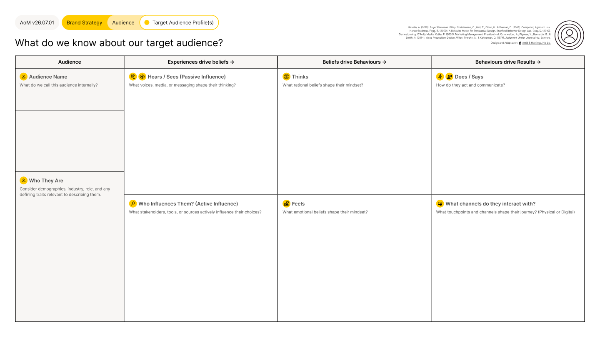

# Target Audience Profile

<figure><figcaption></figcaption></figure>





### Tool Notes

The Target Audience Profile maps what a business knows about a specific audience segment using a structured framework: who they are, what shapes their beliefs, how those beliefs drive behaviour, and what results that behaviour produces.

A target audience is not a media plan. It defines who the business is focusing its value creation efforts on, not who it will reach or exclude in market. Targeting is about concentrating effort where a business can create and capture the most value. Most businesses can serve more than one audience, but without clear prioritisation, resources get spread too thin to build meaningful relevance anywhere.

The dartboard principle applies: aiming at a defined target does not exclude others from being attracted to the offering. It ensures that creative, messaging, and investment decisions have a coherent reference point.

The profile is deliberately channel-agnostic. Different channels have different targeting capabilities: outdoor advertising cannot target by role or profession directly, only proxies. The profile defines the audience. The media plan determines how to reach them.


#### Framework Content

The Target Audience Profile is structured across four columns that trace a causal chain from audience identity through to business results.

**Audience.** Audience Name: what the business calls this audience internally. Who They Are: demographics, industry, role, and defining traits relevant to describing the segment.

**Experiences drive beliefs.** Hears/Sees (Passive Influence): voices, media, or messaging that shape the audience's thinking. Who Influences Them (Active Influence): stakeholders, tools, or sources that actively influence their choices.

**Beliefs drive behaviours.** Thinks: the rational beliefs that shape their mindset. Feels: the emotional beliefs that shape their mindset.

**Behaviours drive results.** Does/Says: how they act and communicate. What channels do they interact with: the touchpoints and channels, physical and digital, that shape their journey.

The framework is completed once per target audience segment. Businesses with multiple target audiences complete a separate profile for each.


### References

The framework draws on Adele Revella's Buyer Personas (2015), Clayton Christensen, Taddy Hall, Karen Dillon, and David Duncan's Jobs to Be Done framework from Competing Against Luck (2016), BJ Fogg's Behavior Model from A Behavior Model for Persuasive Design, Stanford Behavior Design Lab (2009), Dave Gray's Gamestorming (2010), Philip Kotler's Marketing Management (2000), Alexander Osterwalder, Yves Pigneur, Greg Bernarda, and Alan Smith's Value Proposition Design (2014), and Amos Tversky and Daniel Kahneman's Judgment Under Uncertainty (1974). The Target Audience Profile was designed and adapted for the AoM by Kieran Antill and Ross Hastings (2022), integrating these sources into a single structured framework within the AoM design system.

[_See all AoM References_](../../../governance/references.md)



### AoM Structure


{% column width="25%" %}
_Section_


{% column width="75%" %}

[brand-strategy](../../layer-two-fundamentals/brand-strategy/)





{% column width="25%" %}
_Sub-section_


{% column width="75%" %}

[audience](../../layer-two-fundamentals/brand-strategy/audience/)





{% column width="25%" %}
_Connected Fundamental(s)_


{% column width="75%" %}

[target-audience.md](../../layer-two-fundamentals/brand-strategy/audience/target-audience.md)





