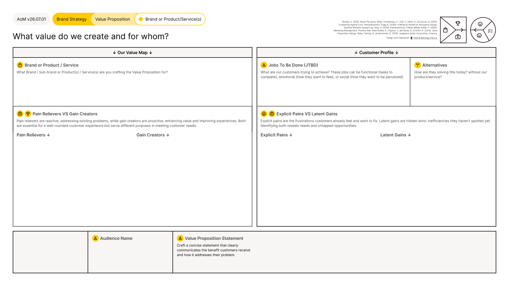

# Value Proposition Framework

<figure><figcaption></figcaption></figure>





### Tool Notes

The Value Proposition framework maps the connection between what a business offers and what a specific audience needs. The same framework applies whether the value proposition is being developed for a brand, a product, or a service: the difference is what is being defined and for whom.

The framework has two sides. The Value Map captures the offering: what brand, product, or service is being evaluated, what pain relievers it provides, and what gains it creates. The Customer Profile captures the audience: what jobs they are trying to do, what explicit pains they already feel, what latent gains they have not yet recognised, and how they are currently solving the problem without the offering.

Pain relievers are reactive: they address existing frustrations. Gain creators are proactive: they enhance value and improve experiences. Both matter, but they serve different purposes in the customer relationship. The output is a Value Proposition Statement: a concise articulation of the benefit the customer receives and how it addresses their problem.


#### Framework Content

The Value Proposition framework is structured across two sides and one output.

**Value Map (left side).** Brand or Product/Service: identify what brand, sub-brand, product, or service the value proposition is being built for. Pain Relievers vs Gain Creators: pain relievers address existing problems reactively. Gain creators proactively enhance value and improve experiences. Both are documented separately.

**Customer Profile (right side).** Jobs To Be Done (JTBD): what are customers trying to achieve? Jobs can be functional (tasks to complete), emotional (how they want to feel), or social (how they want to be perceived). Alternatives: how are customers solving this today without the product or service? Explicit Pains vs Latent Gains: explicit pains are frustrations customers already feel and want to fix. Latent gains are hidden wins, inefficiencies they have not yet spotted. Identifying both reveals current needs and untapped opportunities.

**Value Proposition Statement (output).** Audience Name: the specific audience this value proposition is written for. Value Proposition Statement: a concise statement that clearly communicates the benefit the customer receives and how it addresses their problem.

The framework is completed once per audience segment. Businesses with multiple target audiences or multiple products and services complete a separate framework for each combination.


### References

The framework draws on Adele Revella's Buyer Personas (2015), Clayton Christensen, Taddy Hall, Karen Dillon, and David Duncan's Jobs to Be Done framework from Competing Against Luck (2016), BJ Fogg's Behavior Model from A Behavior Model for Persuasive Design, Stanford Behavior Design Lab (2009), Dave Gray's Gamestorming (2010), Philip Kotler's Marketing Management (2000), Alexander Osterwalder, Yves Pigneur, Greg Bernarda, and Alan Smith's Value Proposition Design (2014), and Amos Tversky and Daniel Kahneman's Judgment Under Uncertainty (1974). The Value Proposition framework was designed and adapted for the AoM by Kieran Antill and Ross Hastings (2022), synthesising these sources into a single connected framework within the AoM design system.

[_See all AoM References_](../../../governance/references.md)



### AoM Structure


{% column width="25%" %}
_Section_


{% column width="75%" %}

[brand-strategy](../../layer-two-fundamentals/brand-strategy/)





{% column width="25%" %}
_Sub-section_


{% column width="75%" %}

[value-proposition-s](../../layer-two-fundamentals/brand-strategy/value-proposition-s/)





{% column width="25%" %}
_Connected Fundamental(s)_


{% column width="75%" %}

[brand-value-proposition.md](../../layer-two-fundamentals/brand-strategy/value-proposition-s/brand-value-proposition.md)



[product-service-value-proposition-s.md](../../layer-two-fundamentals/brand-strategy/value-proposition-s/product-service-value-proposition-s.md)





