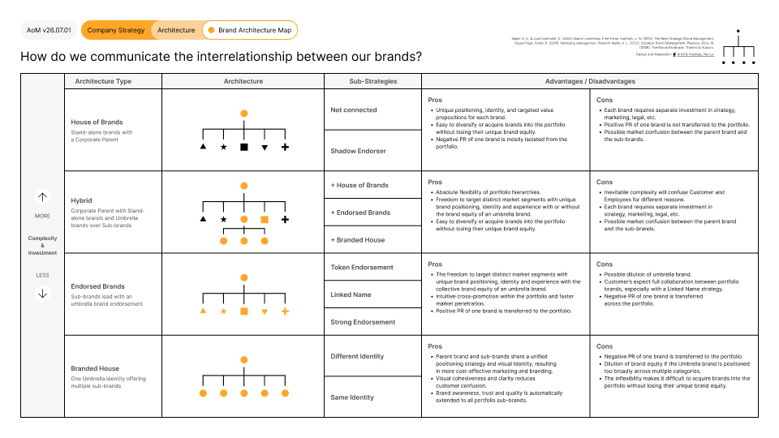

# Brand Architecture Map

<figure><figcaption></figcaption></figure>





### Tool Notes

The Brand Architecture Map plots a portfolio along a spectrum from House of Brands to Branded House. Each position involves a trade-off: more separation gives flexibility and contains risk but increases complexity and cost. More unity reduces complexity and cost but concentrates reputational risk across the portfolio.

The map works as a connected pair with the Product/Service Map. Not everything in a portfolio needs to be a brand. Products and services often carry significant commercial weight without requiring independent brand identity, equity, or investment. The boundary between what constitutes a brand and what is simply a product or service name within an existing brand is one of the most consequential decisions in portfolio management. Working through one map without the other leaves that boundary undefined.


#### Framework Content

The Brand Architecture Map positions a portfolio across four architecture types, ordered from most to least complex and from greatest to least investment required.

**House of Brands.** A corporate parent sits behind stand-alone brands that operate independently. Sub-strategies: Not Connected (no visible relationship between parent and brands), Shadow Endorser (parent present but not prominent). Advantages: unique positioning, identity, and value propositions for each brand; easy to diversify or acquire brands without losing their unique equity; negative PR of one brand is mostly isolated from the portfolio. Disadvantages: each brand requires separate investment in strategy, marketing, and legal; positive PR is not transferred across the portfolio; possible market confusion between parent and sub-brands.

**Hybrid.** A corporate parent sits above both stand-alone brands and umbrella brands that cover sub-brands. Sub-strategies: combines elements of House of Brands, Endorsed Brands, and Branded House. Advantages: absolute flexibility of portfolio hierarchies; freedom to target distinct segments with unique positioning with or without umbrella equity; easy to diversify or acquire brands. Disadvantages: inevitable complexity that will confuse customers and employees; each brand requires separate investment; possible market confusion between parent and sub-brands.

**Endorsed Brands.** Sub-brands lead with an umbrella brand endorsement. Sub-strategies: Token Endorsement, Linked Name, Strong Endorsement. Advantages: freedom to target distinct segments with unique positioning and the collective equity of an umbrella brand; intuitive cross-promotion and faster market penetration; positive PR transfers across the portfolio. Disadvantages: possible dilution of the umbrella brand; customers expect full collaboration between portfolio brands; negative PR transfers across the portfolio.

**Branded House.** One umbrella identity covering multiple sub-brands. Sub-strategies: Different Identity (sub-brands have distinct visual identities within the umbrella), Same Identity (sub-brands share the umbrella's visual identity). Advantages: unified positioning and identity resulting in more cost-effective marketing; visual cohesiveness reduces customer confusion; brand awareness, trust, and quality automatically extend to all sub-brands. Disadvantages: negative PR transfers across the portfolio; dilution risk if the umbrella brand is positioned too broadly; inflexibility makes it difficult to acquire brands without losing their unique equity.

The spectrum runs from more complexity and investment at the House of Brands end to less complexity and investment at the Branded House end. The Hybrid position sits outside the linear spectrum and accommodates diversified portfolios that no single rule fits.


### References

The framework draws on David Aaker and Erich Joachimsthaler's Brand Relationship Spectrum, introduced in Brand Leadership (2000), alongside portfolio and brand-hierarchy thinking from Aaker, Kevin Lane Keller, and Jean-Noël Kapferer, and Wally Olins' work on corporate identity. The Brand Architecture Map was designed and adapted for the AoM by Kieran Antill and Ross Hastings (2022), standardising the positions, language, and colour coding into the connected framework system of the Anatomy of Marketing.

[_See All AoM References_](../../../governance/references.md)



### AoM Structure


{% column width="25%" %}
_Section_


{% column width="75%" %}

[company-strategy](../../layer-two-fundamentals/company-strategy/)





{% column width="25%" %}
_Sub-section_


{% column width="75%" %}

[how](../../layer-two-fundamentals/company-strategy/how/)





{% column width="25%" %}
_Connected Fundamental(s)_


{% column width="75%" %}

[brand-architecture.md](../../layer-two-fundamentals/company-strategy/how/brand-architecture.md)





