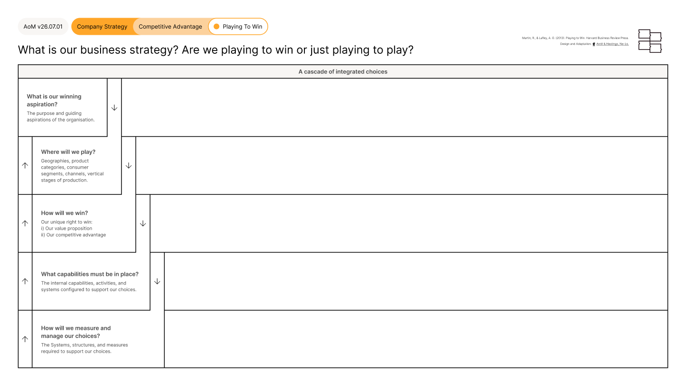

# Playing to Win Framework

<figure><figcaption></figcaption></figure>





### Tool Notes

The Playing to Win Framework structures business strategy as five integrated choices that cascade from one another: Winning Aspiration, Where to Play, How to Win, Core Capabilities, and the management systems required to support them. The choices are designed to be answered together. A decision at one level shapes the choices below it.

The AoM uses Playing to Win as its preferred framework for company strategy because the cascade logic connects directly to how marketing decisions are built on business strategy. Where to Play and How to Win are the foundation on which Brand Strategy, positioning, and investment decisions rest. Martin and Lafley's model makes those connections explicit in a way most strategy frameworks do not.

The Business Model Canvas, developed by Alexander Osterwalder, is a widely used alternative that maps nine building blocks of a business model simultaneously rather than as a cascade. It is a credible and broadly adopted tool. The AoM does not incorporate it because the cascade structure of Playing to Win aligns more directly with the sequential logic of the AoM Fundamental View.


### Framework Content

The Playing to Win Framework is structured as a cascade of five integrated choices, each with a defining question and a scope description.

**Winning Aspiration.** Defining question: What is our winning aspiration? Scope: the purpose and guiding aspirations of the organisation. This is not a vision statement: it is a clear articulation of what winning looks like in the chosen arena.

**Where to Play.** Defining question: Where will we play? Scope: geographies, product categories, consumer segments, channels, and vertical stages of production. This choice defines the competitive arena before the organisation determines how it will win within it.

**How to Win.** Defining question: How will we win? Scope: the unique right to win, defined by two elements: the value proposition and the competitive advantage. This is the strategic heart of the cascade.

**Core Capabilities.** Defining question: What capabilities must be in place? Scope: the internal capabilities, activities, and systems configured to support the strategic choices above. These are not general organisational strengths: they are the specific capabilities that make the chosen competitive advantage possible.

**Management Systems.** Defining question: How will we measure and manage our choices? Scope: the systems, structures, and measures required to support and reinforce the strategic choices across the organisation.

The five choices are designed to be read top to bottom as a cascade and tested bottom to top: if the management systems cannot support the capabilities, if the capabilities cannot deliver the How to Win, or if the How to Win does not fit the Where to Play, the strategy is not coherent and needs to be revisited.


### References

The Playing to Win Framework was introduced by Roger Martin and A.G. Lafley in Playing to Win: How Strategy Really Works, Harvard Business Review Press (2013). The framework was designed and adapted for the AoM by Kieran Antill and Ross Hastings (2022), standardising the visual presentation, language, and colour coding within the AoM design system.

[_See All AoM References_](../../../governance/references.md)



### AoM Structure


{% column width="25%" %}
_Section_


{% column width="75%" %}

[company-strategy](../../layer-two-fundamentals/company-strategy/)





{% column width="25%" %}
_Sub-section_


{% column width="75%" %}

[what](../../layer-two-fundamentals/company-strategy/what/)





{% column width="25%" %}
_Connected Fundamental(s)_


{% column width="75%" %}

[where-to-play.md](../../layer-two-fundamentals/company-strategy/what/where-to-play.md)



[how-to-win.md](../../layer-two-fundamentals/company-strategy/what/how-to-win.md)



[core-capabilities.md](../../layer-two-fundamentals/company-strategy/what/core-capabilities.md)





